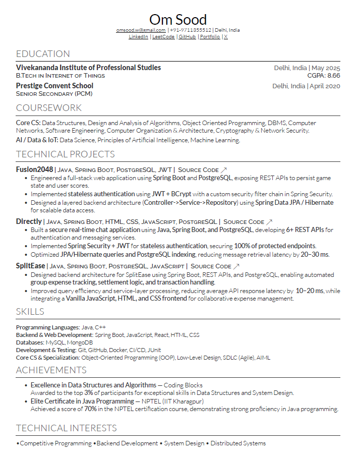

# RESUME
Refer to the resume- professionally formatted using Overleaf- here for a detailed overview of my academic background, core competencies in Java, Spring Boot along with practical experience through impactful projects and recognitions in software development.

---

## Resume Preview



---

## Download Resume

You can download the latest version of my resume here:

**PDF:** [Download Resume](./resume.pdf)

---

## Repository Structure

```
resume/
│
├── resume.tex            # Main LaTeX resume file
├── resume.pdf            # Compiled resume
├── resume-preview.png    # Preview image used in README
│
├── sections/             # Resume sections
│   ├── education.tex
│   ├── projects.tex
│   ├── experience.tex
│   └── skills.tex
│
└── template/             # Resume template files
    └── deedy-resume.cls
```

---

## Technologies Used

* **LaTeX**
* **Overleaf**
* **Deedy Resume Template**
* **GitHub**

---

## How to Use

1. Clone the repository
2. Open `resume.tex` in **Overleaf** or a local LaTeX editor
3. Compile the file to generate the PDF

```
git clone https://github.com/0m12s/resume.git
```

---
